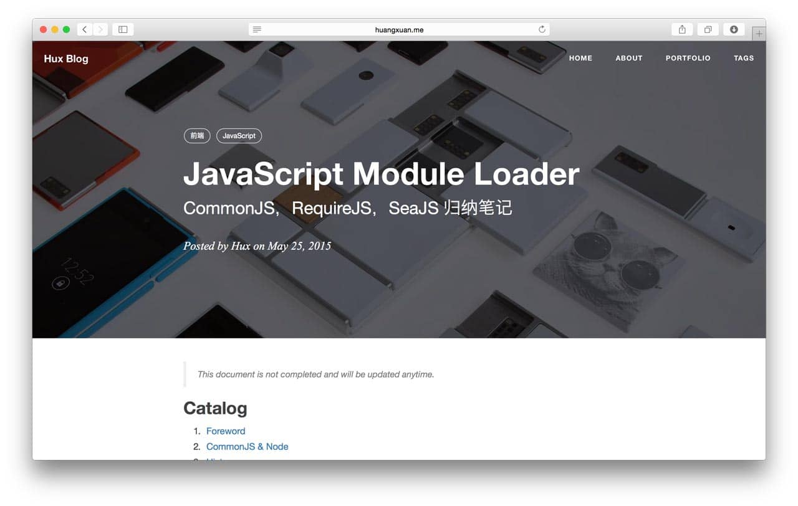

# Bruce Blog

> 一个现代化的 Jekyll 博客系统，支持多语言、暗黑模式和 PWA 功能



## ✨ 特性

- **响应式设计** - 支持桌面端和移动端设备
- **多语言支持** - 支持中文/英文切换
- **暗黑模式** - 自动检测系统偏好，支持手动切换
- **PWA 支持** - 渐进式 Web 应用，可安装到桌面
- **评论系统** - 集成 Giscus 评论功能
- **搜索功能** - 快速全文搜索
- **标签云** - 可视化展示文章标签
- **离线访问** - Service Worker 支持离线浏览
- **性能优化** - 资源缓存、懒加载等优化措施

## 🚀 快速开始

### 环境要求

- [Ruby](https://www.ruby-lang.org/en/) (>= 2.5.0)
- [Bundler](https://bundler.io/)
- [Node.js](https://nodejs.org/) (可选，用于开发构建)

### 本地开发

1. 安装依赖包：

```bash
bundle install
```

2. 启动本地服务器：

```bash
bundle exec jekyll serve
```

或者使用 npm 脚本：

```bash
npm start
```

服务器将在 `http://localhost:4000` 上运行。

### 开发模式

如果你需要修改主题样式或脚本：

```bash
npm run dev
```

这会启动文件监视器并自动重建资源。

## ⚙️ 配置说明

### 基础配置

编辑 `_config.yml` 文件来配置博客：

```yaml
# 站点信息
title: Bruce Blog                    # 博客标题
SEOTitle: Bruce Blog               # SEO 标题
header-img: img/home-bg.jpg        # 页眉背景图
email: aletymode@gmail.com         # 邮箱地址
description: "Bruce 的个人博客，记录 EE 学习、机器人和独立游戏。"  # 博客描述
keyword: "Bruce, EE, Electronics, Robot, Indie Game, Blog"         # SEO 关键词
url: "https://lpiney.github.io"    # 博客地址
lang: "zh-CN"                      # 默认语言
```

### 多语言配置

博客支持中英文切换，通过以下方式配置：

1. 在页面头部添加语言切换按钮
2. 使用 `lang-zh` 和 `lang-en` CSS 类来控制内容显示
3. 系统会自动检测用户语言偏好并记忆用户选择

### 暗黑模式配置

暗黑模式通过以下方式工作：

1. 检测系统偏好设置
2. 记忆用户选择
3. 提供手动切换按钮
4. 自动应用相应样式

### PWA 配置

位于 `pwa/` 目录下的 `manifest.json` 文件配置 PWA 功能：

- 应用名称和描述
- 图标配置
- 显示模式
- 主题颜色

## 📁 项目结构

```
├── _includes/           # 页面组件（页眉、页脚、导航等）
├── _layouts/           # 页面布局模板
├── _posts/             # 博客文章
├── css/                # 样式文件
├── js/                 # JavaScript 文件
│   ├── dark-mode.js    # 暗黑模式功能
│   ├── language.js     # 多语言功能
│   ├── snackbar.js     # 消息提示组件
│   └── sw.js           # Service Worker
├── img/                # 图片资源
├── pwa/                # PWA 相关文件
├── less/               # Less 样式源码
└── ...
```

## 🛠️ 主要功能模块

### 暗黑模式 (dark-mode.js)

- 自动检测系统主题偏好
- 记忆用户选择
- 平滑过渡动画
- 图标自动切换

### 多语言支持 (language.js)

- 中英文切换
- 记忆用户偏好
- 动态更新页面语言属性
- 支持语言切换事件

### 消息提示 (snackbar.js)

- 底部弹出消息
- 可配置操作按钮
- 自动消失或手动关闭
- 支持多种状态样式

### Service Worker (sw.js)

- 资源预缓存
- 网络优先策略
- 离线访问支持
- 自动更新检测

### 标签云 (jquery.tagcloud.js)

- 根据权重调整字体大小
- 支持颜色渐变
- 响应式设计

## 📝 文章写作

### 创建新文章

在 `_posts/` 目录下创建新文件，命名格式为 `YYYY-MM-DD-title.markdown`：

```markdown
---
layout: post
title: "文章标题"
subtitle: "副标题"
date: 2024-01-01 12:00:00
author: "作者名"
header-img: "img/post-bg-default.jpg"
catalog: true
tags:
  - 标签1
  - 标签2
---

文章正文内容...
```

### Front Matter 说明

- `layout`: 页面布局
- `title`: 文章标题
- `subtitle`: 副标题
- `date`: 发布日期
- `author`: 作者
- `header-img`: 页眉背景图
- `catalog`: 是否显示目录
- `tags`: 文章标签

## 🔧 自定义开发

### 样式定制

- 修改 `less/` 目录下的 Less 文件
- 运行 `grunt` 命令编译生成 CSS
- 或直接修改 `css/` 目录下的 CSS 文件

### 功能扩展

通过以下方式扩展功能：

1. 在 `js/` 目录添加新的 JavaScript 文件
2. 在 `_includes/` 添加新的组件
3. 在 `_layouts/` 添加新的页面布局

## 📱 PWA 功能

博客支持 PWA 功能，包括：

- **可安装** - 用户可将网站添加到主屏幕
- **离线访问** - 即使无网络连接也可浏览内容
- **推送通知** - 支持未来扩展推送功能
- **原生应用体验** - 流畅的交互体验

## 🌐 部署

### GitHub Pages 部署

项目已配置为通过 GitHub Pages 部署：

1. 将代码推送到 GitHub 仓库
2. 在仓库设置中启用 GitHub Pages
3. 选择 `master` 分支作为源

### 自定义域名

1. 在仓库根目录创建 `CNAME` 文件
2. 在文件中写入你的域名
3. 在 DNS 设置中配置 CNAME 记录

## 🤝 贡献

欢迎提交 Issue 和 Pull Request 来改进项目。

## 📄 许可证

本项目基于 Apache License 2.0 许可证开源。

原始项目来自 [Hux Blog](https://github.com/Huxpro/huxpro.github.io)，在此基础上进行了大量优化和定制。

## 🙏 致谢

- 感谢 [Hux Blog](https://github.com/Huxpro/huxpro.github.io) 提供的基础框架
- 感谢 [Jekyll](https://jekyllrb.com/) 静态站点生成器
- 感谢 [Bootstrap](https://getbootstrap.com/) 前端框架